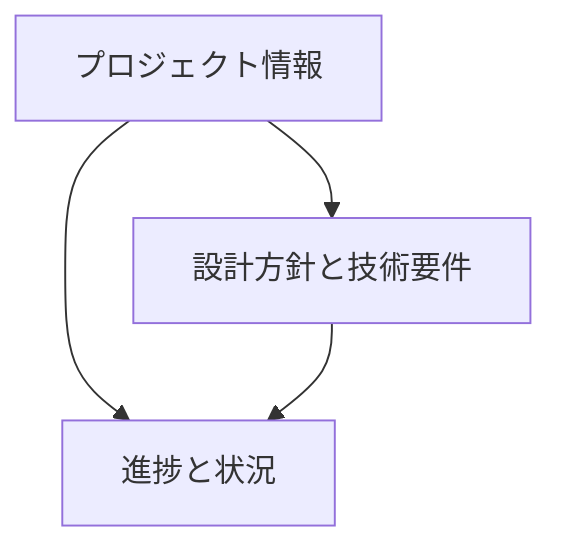

# Qt6バインディング メモリバンク

このディレクトリは、Qt6バインディングプロジェクトの開発において、AIが効率的に作業を進めるために必要な情報を整理・保持するためのメモリバンクです。

## 1. ディレクトリ構造

### 1.1 プロジェクト情報 (project/)
- プロジェクトの目的と要件
- 対象クラスと機能
- 品質要件と完了定義
- 制約条件とリスク

### 1.2 設計方針と技術要件 (context/)
- バインディング設計の方針
- 技術的な制約と要件
- 開発環境の要件
- テスト環境の要件

### 1.3 進捗と状況 (status/)
- 実装済み機能
- 実装品質の状態
- テストの状況
- ドキュメントの状況
- 残タスク
- 次期リリース目標

## 2. 情報の流れ

### 2.1 プロジェクト情報からの流れ
- 要件が設計方針に影響
- 品質基準が実装状況の評価に影響
- 制約が技術選択に影響

### 2.2 設計方針からの流れ
- 設計方針が実装方法を決定
- 技術要件が実装の制約を決定
- 環境要件がテスト方法を決定

### 2.3 状況の更新
- 実装の進捗を記録
- 品質評価の結果を反映
- 残タスクの更新
- 次のステップの計画

## 3. 更新ルール

### 3.1 更新の記録
- 日時
- 対象ファイル
- 変更の種類
- 変更内容

### 3.2 整合性の確保
- 関連ファイルの同時更新
- 依存関係の確認
- 矛盾の検出と解決

### 3.3 履歴の管理
- 重要な決定の記録
- 問題と解決策の記録
- 設計変更の記録
