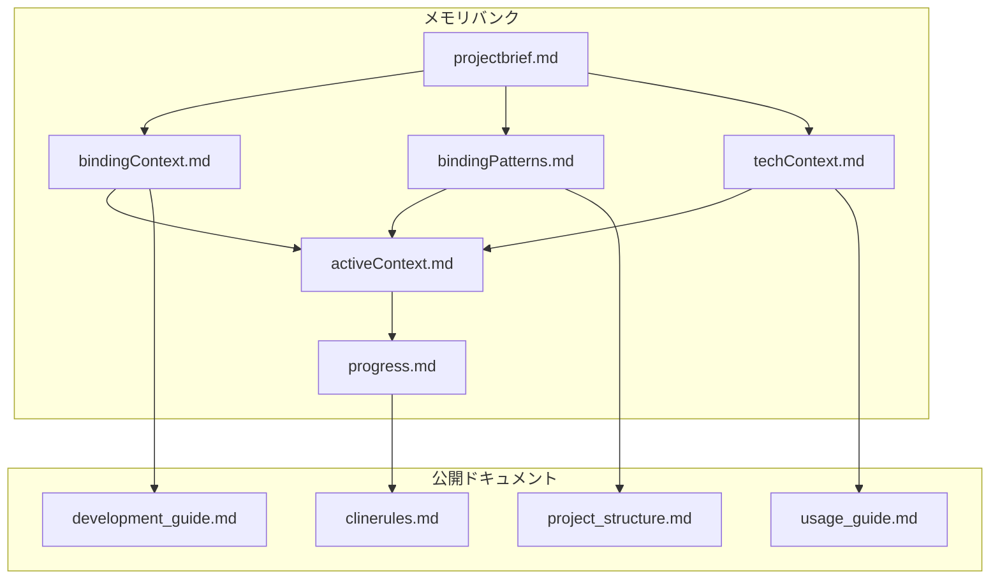

# Qt6バインディング メモリバンク構造

## 1. メモリバンクの目的

このメモリバンク構造は、Qt6バインディングプロジェクトの開発において、AIが効率的に作業を進めるために必要な情報を整理・保持するためのものです。

## 2. ファイル構成と関係



### 2.1 ファイルの配置
```
.cline/
├── memory/
│   ├── projectbrief.md      # プロジェクトの概要と目標
│   ├── bindingContext.md    # バインディングの文脈と要件
│   ├── bindingPatterns.md   # 実装パターンと規則
│   ├── techContext.md       # 技術的な制約と要件
│   ├── activeContext.md     # 現在の作業状況
│   └── progress.md         # 進捗状況
└── docs/                   # 生成されたドキュメント
    ├── README.md          # ドキュメント体系の説明
    ├── project_structure.md
    ├── usage_guide.md
    ├── development_guide.md
    └── clinerules.md
```

## 3. ドキュメント間の関係

### 3.1 メモリバンク内の関係
1. projectbrief.md → bindingContext.md
   - プロジェクトの要件がバインディング設計に影響
   - 品質基準が設計方針を決定

2. projectbrief.md → bindingPatterns.md
   - 対象クラスが実装パターンを決定
   - 品質要件がテストパターンを決定

3. projectbrief.md → techContext.md
   - プロジェクト要件が技術選択に影響
   - 品質基準が環境要件を決定

4. bindingContext.md/bindingPatterns.md/techContext.md → activeContext.md
   - 設計方針が現在の実装に影響
   - 実装パターンが作業方法を決定
   - 技術要件が実装の制約を決定

5. activeContext.md → progress.md
   - 現在の状況が進捗に反映
   - 課題が残タスクとして記録

### 3.2 公開ドキュメントとの関係
1. bindingPatterns.md → project_structure.md
   - 実装パターンがプロジェクト構造を決定
   - テストパターンがディレクトリ構成に影響

2. techContext.md → usage_guide.md
   - 技術要件が使用方法を制約
   - 環境設定が利用手順を決定

3. bindingContext.md → development_guide.md
   - 設計方針が開発手順を決定
   - バインディング規則が実装方法を決定

4. progress.md → clinerules.md
   - 進捗状況がルール更新に影響
   - 課題が新規ルールの追加を促進

## 4. 更新手順

### 4.1 メモリバンクの更新
1. 変更の記録
   ```markdown
   ## 更新内容
   - 日時: YYYY/MM/DD HH:MM
   - 対象: [ファイル名]
   - 種類: [追加/修正/削除]
   - 内容: [具体的な変更内容]
   ```

2. 関連ファイルの更新
   - 影響を受けるファイルの特定
   - 変更の伝播
   - 整合性の確認

3. 進捗の更新
   - activeContext.mdの更新
   - progress.mdの更新
   - 必要に応じてprojectbrief.mdの更新

### 4.2 公開ドキュメントの更新
1. メモリバンクの変更を反映
   - 実装規則の更新
   - 例の追加/更新
   - 説明の改善

2. 相互参照の更新
   - リンクの確認
   - 参照先の存在確認
   - 参照内容の正確性確認

3. 形式の統一
   - 用語の統一
   - コード例の形式統一
   - 見出しレベルの統一

## 5. 品質管理

### 5.1 一貫性の確保
- 用語の統一的な使用
- 形式の統一
- 相互参照の整合性
- 例の一貫性

### 5.2 完全性の確保
- 必要な情報の網羅
- 更新の確実な反映
- 参照の完全性
- 例の十分性

### 5.3 正確性の確保
- 情報の正確性
- コード例の動作確認
- 参照先の正確性
- 説明の正確性
