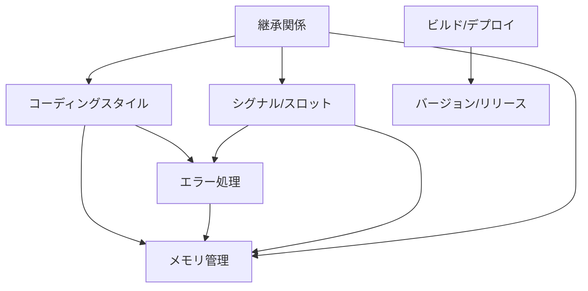

# Qt6バインディング プロジェクトルール インデックス

## 1. ルールの構成

このディレクトリには、Qt6バインディングプロジェクトの開発に関する各種ルールが含まれています。

### 1.1 コア開発ルール
- [コーディングスタイル](coding_style.md)
  - ファイル構造
  - 命名規則
  - コメント規約
  - フォーマット規則

- [エラー処理](error_handling.md)
  - エラーコード体系
  - エラー情報構造
  - エラー処理パターン
  - デバッグサポート

- [メモリ管理](memory_management.md)
  - リソース管理パターン
  - スコープベース管理
  - 参照カウント
  - メモリリーク防止

### 1.2 Qt固有のルール
- [シグナル/スロット](signal_slot.md)
  - シグナルハンドラ
  - コールバック管理
  - スレッド安全性
  - デバッグサポート

- [継承関係](inheritance.md)
  - 継承階層の設計
  - 型変換と検証
  - メソッドの継承
  - C APIの実装
  - 継承メソッドの実装パターン
    * 継承元関数の再利用
    * 型変換を含む実装
    * 追加処理が必要な場合
  - 継承チェーンの管理
  - メモリ管理との統合
  - デバッグとテスト

### 1.3 プロジェクト管理ルール
- [ビルドとデプロイメント](build_deploy.md)
  - CMake設定
  - プラットフォーム設定
  - インストール設定
  - テスト設定

- [バージョン管理とリリース](version_release.md)
  - バージョニング規則
  - Git運用ルール
  - リリースプロセス
  - 品質管理

## 2. ルールの適用

### 2.1 優先順位
1. 安全性に関するルール
   - メモリ管理
   - エラー処理
   - スレッド安全性

2. 機能性に関するルール
   - シグナル/スロット
   - 継承関係
   - API設計

3. 保守性に関するルール
   - コーディングスタイル
   - ドキュメント
   - テスト

### 2.2 例外事項
- パフォーマンス最適化のための例外
- プラットフォーム固有の例外
- 後方互換性のための例外

## 3. ルールの更新プロセス

### 3.1 更新の提案
1. 問題点の特定
   - 現行ルールの課題
   - 新しい要件
   - 改善の機会

2. 解決策の提示
   - 具体的な変更案
   - メリット/デメリット
   - 影響範囲

### 3.2 レビューと承認
1. レビュー基準
   - 技術的な妥当性
   - 実装の容易さ
   - 既存コードへの影響

2. 承認プロセス
   - チームでの議論
   - 試験的な適用
   - 正式な採用

### 3.3 文書化と展開
1. ドキュメントの更新
   - ルールの追加/変更
   - 例の更新
   - 移行ガイド

2. チームへの展開
   - 変更の通知
   - トレーニング
   - フィードバック収集

## 4. 相互参照

### 4.1 ルール間の関係

### 4.2 依存関係
- メモリ管理 ← エラー処理
- シグナル/スロット ← スレッド安全性
- 継承関係 ← メモリ管理、コーディングスタイル
- ビルド設定 ← プラットフォーム要件

### 4.3 実装パターンの優先順位
1. 安全性に関するパターン
   - メモリ管理パターン
   - エラー処理パターン
   - スレッドセーフパターン

2. 機能性に関するパターン
   - 継承メソッドの実装パターン
   - シグナル/スロットパターン
   - イベント処理パターン

3. 保守性に関するパターン
   - コーディングスタイルパターン
   - ドキュメントパターン
   - テストパターン

## 5. 補足資料

### 5.1 参考文献
- Qt6ドキュメント
- C++コーディング標準
- CMakeベストプラクティス
- Gitブランチ戦略ガイド

### 5.2 ツール
- 静的解析ツール
- メモリチェッカー
- コードフォーマッタ
- ドキュメント生成ツール
