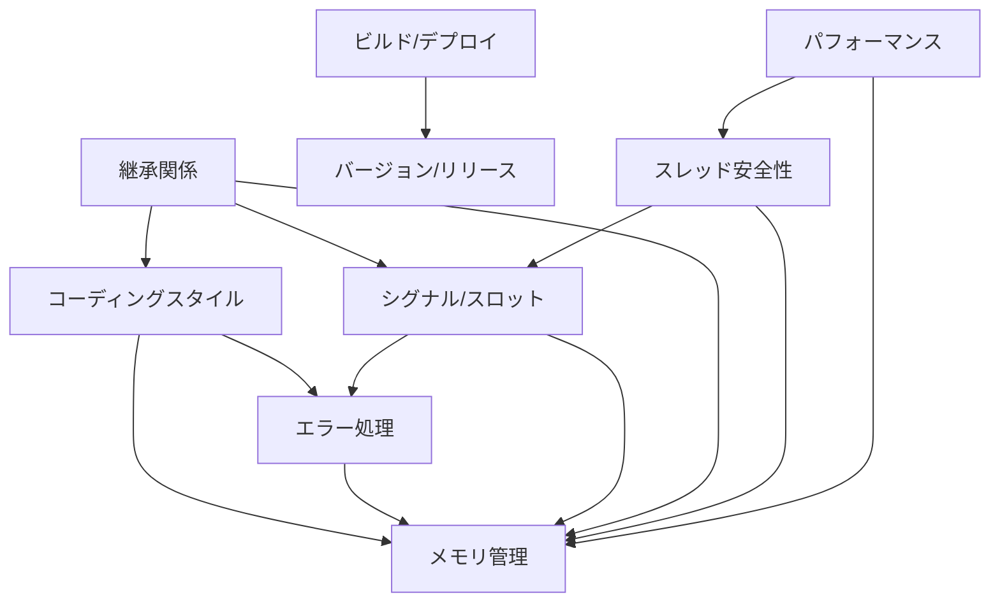

# Qt6バインディング プロジェクトルール インデックス

## 1. ルールの構成

このディレクトリには、Qt6バインディングプロジェクトの開発に関する各種ルールが含まれています。

### 1.1 コア開発ルール
- [コーディングスタイル](coding_style.md)
  - ファイル構造
  - 命名規則
  - コメント
  - インデントとフォーマット
  - ファイル編成
  - コード構造
  - 制約と規約

- [エラー処理](error_handling.md)
  - エラーコード体系
  - エラー処理パターン
  - エラー処理戦略
  - エラーログ記録
  - エラー回復
  - デバッグサポート

- [メモリ管理](memory_management.md)
  - 基本原則
  - メモリ管理パターン
  - Qt特有のメモリ管理
  - C APIのメモリ管理
  - メモリリーク防止

### 1.2 Qt固有のルール
- [シグナル/スロット](signal_slot.md)
  - 基本概念
  - シグナルハンドラの実装
  - C APIインターフェース
  - データ変換

- [継承関係](inheritance.md)
  - 基本原則
  - 型変換と検証
  - メソッドの継承
  - C APIの実装
  - メモリ管理
  - デバッグサポート
  - 実装パターン

- [バインディングパターン](binding_patterns.md)
  - バインディングクラス
  - ハンドラクラス
  - C API
  - 継承
  - シグナル/スロット
  - エラー処理
  - メモリ管理
  - テスト

### 1.3 パフォーマンスと安全性
- [スレッド安全性](thread_safety.md)
  - 基本原則
  - シグナル/スロットのスレッド安全性
  - リソース管理
  - 同期プリミティブ
  - スレッドプール
  - スレッド安全なデータ構造

- [パフォーマンス](performance.md)
  - 基本原則
  - メモリ最適化
  - CPU最適化
  - I/O最適化
  - 並列処理
  - プロファイリング
  - パフォーマンスモニタリング

### 1.4 プロジェクト管理ルール
- [ビルドとデプロイメント](build_deploy.md)
  - CMake設定
  - ビルド設定
  - インストール設定
  - デプロイメント
  - テスト設定

- [バージョン管理とリリース](version_release.md)
  - バージョニング規則
  - Git運用ルール
  - リリースプロセス
  - ドキュメント管理
  - 品質管理
  - 保守とサポート

## 2. ルールの適用

### 2.1 優先順位
1. 安全性に関するルール
   - メモリ管理
   - エラー処理
   - スレッド安全性

2. 機能性に関するルール
   - シグナル/スロット
   - 継承関係
   - API設計

3. 保守性に関するルール
   - コーディングスタイル
   - ドキュメント
   - テスト

### 2.2 例外事項
- パフォーマンス最適化のための例外
- プラットフォーム固有の例外
- 後方互換性のための例外

## 3. 相互参照

### 3.1 ルール間の関係

### 3.2 依存関係
- メモリ管理 ← エラー処理
- シグナル/スロット ← スレッド安全性
- 継承関係 ← メモリ管理、コーディングスタイル
- ビルド設定 ← プラットフォーム要件
- パフォーマンス ← メモリ管理、スレッド安全性
